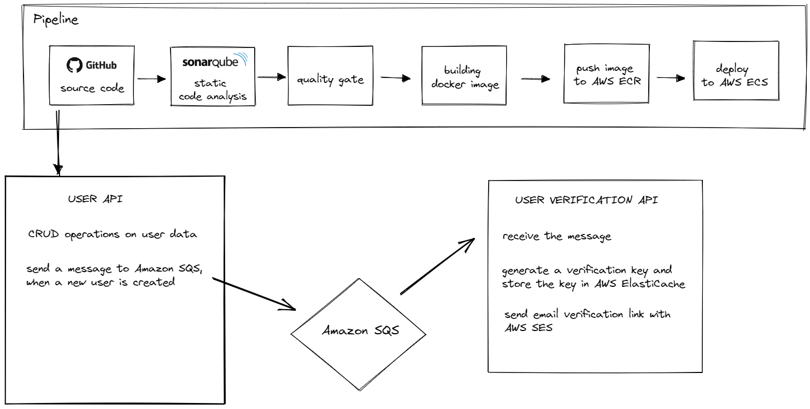

# solidcrane

It's a side project that I started to accomplish the objectives listed below.

- build a **public API**
- build a basic **CI/CD pipeline**
- experience some services of **a cloud provider** (AWS)
- **try out** a programming language you've never used before. (Golang)

**Some technologies to be used:** Golang, Jenkins, Sonarqube AWS ECR, AWS ECS, Route 53, DynamoDB, Amazon SQS, Amazon ElastiCache for Redis, and AWS SES.  

For more details, go through the [steps.](#steps)

Gotten inspiration from this [article.](https://yigitdarcin.com/haydi-ufak-bir-bootcamp-projesi-yapal%C4%B1m-3c9602b93b5f)

## Project Structure

## Steps  
### 1. Choosing a project  (DONE)
Implement a system that keeps track of user information and sends users a verification email to confirm their email addresses.

Starting with a simple API, we will then continue to expand upon it.

### 2. Writing a basic API (DONE)

Write a simple service that converts the text that is provided to it from lowercase to uppercase. 

**Dockerize** the application.

### 3. Deployment and pipeline (DONE)

Choose a cloud provider (AWS)
- **Amazon ECR** to host images 
- **Amazon ECS** for deployment

Automate Deployment 
- **Jenkins** for CI/CD workflow 

Add **image building stage** to the pipeline

Add **deployment stage** to the pipeline

### 4. Unit tests (DONE)
Write a unit test for our basic service.  

Add a **testing stage** to the pipeline 
- **SonarQube** as a static analysis tool 

Add a **quality gate** to the pipeline 

### 5. Make the API public (DONE)

Register a domain name 

Direct the registered domain to this application via **Route 53**
- project-pipeline.ga

### 6. Implement the actual API  

Choose a database (**DynamoDB**) **(DONE)**

Modify the case converter service to implement a basic user API  **(WORKING ON)**

Implement user-API that performs CRUD operations on user data

Write unit tests for user-API 

### 7. Implement an async email verification system 

Create an **Amazon SQS** queue

When a user is created in user-API, send a message to the **AWS SQS queue**

Implement user-verification-API that
- Listens to the **Amazon SQS queue**
- Generate a key for user verification
- Store the key in **Amazon ElastiCache for Redis**
- Send the confirmation link via **AWS SES** 
